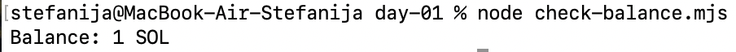

# Day 1: Generate a keypair and get devnet SOL

## What I built
- `create-wallet.mjs` — generates a new keypair and prints the address
- `check-balance.mjs` — checks the SOL balance of a given address

## What I learned

Keypair instead of nickname and password, generated entirely on your machine without network call. 
The address is derived mathematically from the private key using the Ed25519 algorithm.
The public key is my address (shareable), the private key proves ownership (secret)
Devnet SOL is free test currency for development.
## Proof of work

My wallet address: `HWAzXu14v6HzC3NhhiqxK7uF1KBuTxiLXJh1pDYyQxvJ`
