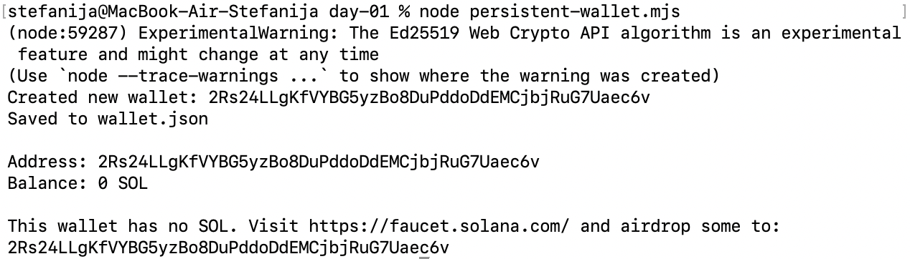

# Day 1: Generate a keypair and get devnet SOL

## What I built
- `create-wallet.mjs` — generates a new keypair and prints the address
- `check-balance.mjs` — checks the SOL balance of a given address

## What I learned

Keypair instead of nickname and password, generated entirely on your machine without network call. 
The address is derived mathematically from the private key using the Ed25519 algorithm.
The public key is my address (shareable), the private key proves ownership (secret)
Devnet SOL is free test currency for development.
## Proof of work


My wallet address: `HWAzXu14v6HzC3NhhiqxK7uF1KBuTxiLXJh1pDYyQxvJ`

# Day 2: Create a persisent wallet and check its balance programmatically

> Day 1 was like creating a user account manually in a database admin tool. Day 2 is like building the signup API.

## What I built
- `persisent_wallet.mjs` - loads and shows balance of existed waller, otherwise creates new wallet

## What I learned

Before, the script would create a new wallet each time. This time it remembers. Important functions from `@solana/kit`:

- `generateKeyPair` (not `generateKeyPairSigner` like Day 1) — gives you the raw cryptographic keys, which you need to export to a file
- `createKeyPairSignerFromBytes` — rebuilds a wallet from saved bytes
- `createSignerFromKeyPair` — wraps a fresh keypair into a usable wallet signer
- `readFile`, `writeFile` — Node's built-in tools for reading/writing files on disk

We use `generateKeyPair(true)`. By default, cryptographic keys are locked inside the computer's crypto subsystem for security — you can use them but not see them. With `true`, you can export them to save them.

**Public key** can be extracted as raw bytes:

​```javascript
const publicKeyBytes = new Uint8Array(
  await crypto.subtle.exportKey("raw", keyPair.publicKey)
);
​```

**Private key** can only be exported in PKCS8 format, a standard wrapper that adds 16 bytes of metadata at the start. So the script exports as PKCS8, then uses `.slice(-32)` to grab just the last 32 bytes:

​```javascript
const pkcs8 = await crypto.subtle.exportKey("pkcs8", keyPair.privateKey);
const privateKeyBytes = new Uint8Array(pkcs8).slice(-32);
​```

Solana stores the keypair in a 64-byte array: private key first (bytes 0–31), public key second (bytes 32–63):

​```javascript
const keypairBytes = new Uint8Array(64);
keypairBytes.set(privateKeyBytes, 0);
keypairBytes.set(publicKeyBytes, 32);
​```

## Proof of work


